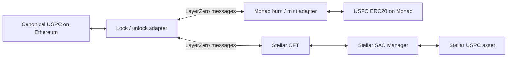

# Architecture and integration boundaries

## Token movement

For Ethereum → destination, the Ethereum adapter holds canonical USPC and sends a message describing the recipient and token amount. After the configured verification threshold is satisfied, the destination bridge mints the representation. For destination → Ethereum, the destination burns the representation before the Ethereum adapter releases collateral.

The receive path authenticates the LayerZero Endpoint and configured remote peer. A public ERC20 transfer to an adapter is not equivalent to invoking the bridge's send method and does not create a delivery message.

## Contracts included in this release

- **Ethereum:** LayerZero's `OFTLockUnlockExtendedRBACUpgradeable`, an OpenZeppelin transparent proxy, and its ProxyAdmin.
- **Monad:** LayerZero's `OFTBurnMintExtendedRBACUpgradeable`, an OpenZeppelin transparent proxy and ProxyAdmin, and the custom `USPCMonad` ERC20. The Solidity class is named `USPCMonad`; its token name and symbol are `USPC`.
- **Stellar:** LayerZero's OFT and SAC Manager contracts from the pinned Rust source revision. The Stellar Asset Contract is a native network asset wrapper, not an additional custom Rust token implementation.

The canonical Ethereum USPC vault, NAV feed, subscription/redemption hub, LayerZero Endpoints, message libraries, DVNs, and Executors are referenced external infrastructure. Including an interface or a compiler dependency does not imply that this project deployed that infrastructure.

## Amounts and collateral

| Representation          | Local decimals | Raw units for 1 USPC |
| ----------------------- | -------------: | -------------------: |
| Ethereum USPC           |              6 |            1,000,000 |
| Monad USPC              |              6 |            1,000,000 |
| Stellar USPC asset      |              7 |           10,000,000 |
| LayerZero shared amount |              6 |            1,000,000 |

Stellar USPC uses the built-in Stellar Asset Contract (SAC), whose issued assets use 7 decimal places. This is expected for that asset type, not a deployment error; custom Soroban contract tokens can choose other precisions. See Stellar's [SAC precision documentation](https://developers.stellar.org/docs/tokens/usdt0-layerzero#amount-precision) and [contract-token example](https://developers.stellar.org/docs/build/smart-contracts/example-contracts/tokens).

The bridge converts between local units and 6 shared decimals. One USPC is `1,000,000` raw units on Ethereum/Monad and `10,000,000` on Stellar. Stellar's conversion factor is `10`, so the token quantity is unchanged. Cross-chain receive amounts use 6 decimals; check the quote for fees and rounding. This decimal difference does not require redeployment.

The Ethereum adapter backs both destination representations. When reconciling circulating supply, do not add locked Ethereum collateral to the destination tokens it backs. Also account for messages whose source debit succeeded but whose destination credit is still pending. A simple comparison of unrelated latest-chain balances is not a complete supply audit.

## NAV and redemption

The canonical Ethereum token is a vault share backed by iUSPC. Its reference valuation uses the Ethereum vault's asset/share conversion and iUSPC NAV. The bridge does not make that conversion ratio permanently 1:1, establish a $1 market price, or deploy a NAV/redemption system on Monad or Stellar.

Bridging preserves the USPC token quantity. To use the Ethereum vault's withdrawal or redemption mechanisms, a holder must return to Ethereum and satisfy the underlying protocol's eligibility and operation requirements. Secondary-market liquidity and collateral-price feeds are separate integration concerns.

## Route controls

Ethereum ↔ Stellar and Ethereum ↔ Monad are independently configured routes. There is no direct Stellar ↔ Monad peer pair. Destination-to-destination movement therefore requires two sends through Ethereum, each with its own verification, fee, limit consumption, and delivery lifecycle.

The recorded policy requires LayerZero Labs, Nethermind, and Horizen for each route. All three must attest; a missing required verifier can delay delivery. Read the current configuration for confirmations and other mutable settings.

Both implementations use token buckets: usage decays at `limit / window`, restoring capacity over time. Gross accounting counts each direction separately; net accounting can offset opposite-direction usage. Limits, windows, and accounting mode are mutable contract settings.

## Administration and upgradeability

The EVM bridge proxy, implementation, ProxyAdmin, and token are distinct contracts. Implementation addresses contain logic; user sends target the proxy. ProxyAdmin ownership governs adapter upgrades. Bridge roles separately govern pausing, unpausing, rate limits, fees, and messaging configuration.

The Monad ERC20 is non-upgradeable. Its `BRIDGE_ROLE` permits the adapter to mint and to burn tokens with allowance. Token administrators can manage that role, so administrative trust remains relevant even without token upgrades. The plain Monad token does not implement the canonical vault's transfer denylist or NAV logic; bridge pausing is distinct from pausing ERC20 transfers.

Stellar OFT, SAC Manager, and asset authority should likewise be inspected separately. Read current permissions from the contracts.

See [the deployment manifest](../deployments/mainnet.json) for contract identities and [security and administration](../README.md#security-and-administration).
